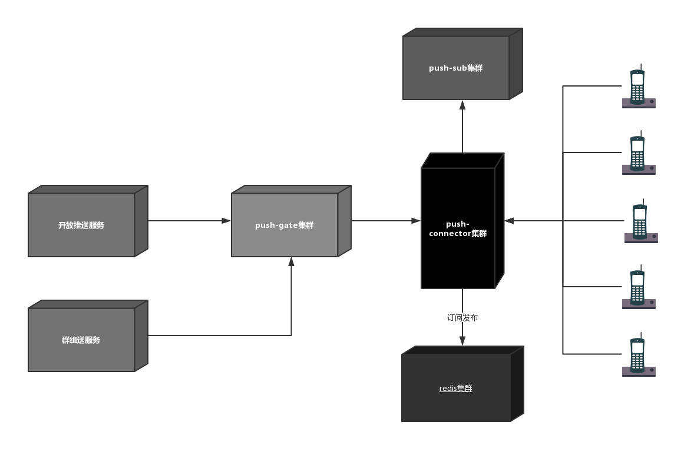

# 统一推送架构
本项目采用java构建统一的推送平台，旨在寻求中高并发，高可用的推送系统，主要功能包括推送功能，群聊功能，以及有推送衍生出来的推送业务系统

## 链接网关服务

* 提供集群链接管理的能力
* 提供消息群发的功能
* 提供消息单发的功能
* 客户端管理服务

链接网关尽量逻辑简单，只提供链接功能，维护客户端的链接关系，对于群组的维护可以在推送业务层去处理
### 提供链接网关
### 提供RPC接口,方便发送推送消息
### 提供集群部署方案
集群方案可能出现以下问题
* 集群模式如何给单个用户推送消息  
因为不同用户可能链接不同的push-connector,所以推送的时候首先要找到这个用户所链接的connector，然后再向其推送消息
* 群推送  
给某一用户组推送，可以根据用户id找到其所在的网络，然后在调远程接口进行推送，这种方式需要维护一个链接关系表
* 消息发布订阅模型  
客户端与connector的映射关系可以在redis中维护，可以采用redis的发布订阅模型通知其他connector进行后续操作

## 鉴权服务
在客户端与服务端建立链接之后，需要进行认证才能进行后续的推送，否则将会自动断开链接

## 推送网关
所有推送到客户端的请求都必须经过此网关，确保推送出口一致，此网关仅仅提供RPC调用接口，以提高接口调用效率
* 提供单推功能
* 提供群组推送功能

## 聊天服务
* 单聊服务
* 群组服务

## 三方推送服务
提供推送Http接口服务，调用推送网关发送推送消息，此接口采用springboot开发web服务

# 通信协议设计

推送服务与客户端交互统一采用的协议，协议主要包括消息头与消息体.对于不同的设备可以适当采取合适的鉴权协议

## 消息头
* 标识位 0xf8 代表推送协议开始
* 版本号 代表协议版本号，供以后升级判断使用
* 信令类型  
订阅，心跳，推送
* 消息体长度 2个字节存储消息体长度
* 附加信息  
加密，压缩算法

* 二进制协议
消息头暂时是5个byte
第一个字节代表信令类型，接着四个个字节代表body消息体长度

## 消息体
消息体主要是指在不同信令类型，消息体所装载的数据，这里字段暂时使用json格式，由各个类型的信令自行决定具体的消息格式

# 参考资料

## 参考项目
* [T-io](https://github.com/tywo45/t-io)
* [蚂蚁通信框架实践](https://mp.weixin.qq.com/s/JRsbK1Un2av9GKmJ8DK7IQ)

